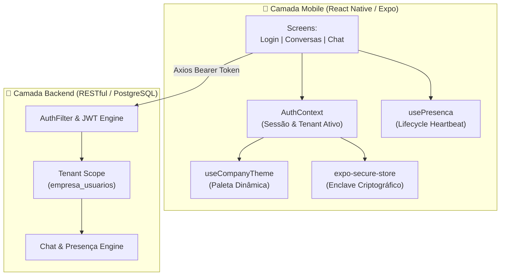

# 📱 Tchat Mobile — WhatsApp Corporativo & Plataforma Multiempresa

[](https://reactnative.dev/)
[](https://expo.dev/)
[](https://www.typescriptlang.org/)
[](https://react.dev/)
[](#-arquitetura-e-decisões-de-engenharia)
[](LICENSE)

O **Tchat Mobile** é uma solução de comunicação corporativa móvel inspirada na experiência de usuário do WhatsApp, desenvolvida para operar como um **SaaS B2B Multiempresa (White-label)**.

O projeto resolve uma das maiores dores de conformidade e segurança das empresas modernas: **o uso de mensageiros pessoais para assuntos de trabalho**. Ao centralizar a comunicação em um ambiente privativo, o Tchat garante isolamento de dados entre organizações, controle de acesso em tempo real, governança de colaboradores e personalização visual dinâmica da marca.

---

## 💼 Caso de Negócio & Proposta de Valor

| Problema com Mensageiros Convencionais | Solução Entregue pelo Tchat Mobile |
| :--- | :--- |
| **Vazamento de dados corporativos**: Colaboradores misturam conversas de trabalho e pessoais em contas particulares. | **Ambiente 100% corporativo**: Apenas membros ativos da mesma empresa conseguem conversar entre si. |
| **Dificuldade de desligamento**: Funcionários demitidos continuam nos grupos de WhatsApp com histórico preservado. | **Revogação de acesso instantânea**: Desligar um membro no backend encerra sua sessão móvel imediatamente. |
| **Falta de identidade corporativa**: O ambiente não reflete a marca da organização contratante. | **White-label dinâmico em runtime**: O app assume a paleta de cores e logotipo da empresa sem recompilação. |
| **Prestadores de serviço em múltiplos clientes**: Necessidade de vários números ou contas para diferentes empresas. | **Suporte nativo a múltiplos vínculos**: Alternância fluida de ambiente corporativo no mesmo login. |

---

## 🎯 Funcionalidades Principais

* **🎨 Identidade Visual Dinâmica (White-label Runtime)**: Ao autenticar, o aplicativo consome o tema da organização ativa e atualiza headers, botões de ação e emblemas de notificação em tempo real.
* **💬 Experiência Completa de WhatsApp**:
  * Balões de mensagens alinhados (enviados/recebidos) com suporte a fotos em anexo.
  * **Tiques de entrega e leitura**: 1 tique cinza (enviada), 2 tiques cinzas (entregue no servidor) e **2 tiques azuis** (lida pelo destinatário).
  * Contador inteligente de mensagens não lidas com zeramento automático ao abrir o chat.
* **👥 Diretório Corporativo de Colaboradores**:
  * Ao tocar no botão flutuante (**+**), lista todos os membros ativos da mesma organização com busca instantânea por nome ou telefone.
  * Início de conversas privadas 1-a-1 com validação cruzada de permissões.
* **🟢 Presença em Tempo Real (Heartbeat Otimizado)**:
  * Sistema de ping periódico de presença online a cada 45 segundos em primeiro plano.
  * Monitoramento de ciclo de vida (`AppState`): marcação automática como offline ao minimizar ou fechar o app para economizar bateria.
* **🔄 Alternância Rápida de Organização (Multi-tenant)**:
  * Usuários vinculados a mais de uma empresa podem trocar de ambiente através do menu superior sem necessidade de logout.
* **🔒 Segurança Mobile de Ponta**:
  * Armazenamento de credenciais no enclave criptográfico do sistema operacional via `expo-secure-store`.
  * Interceptors Axios para injeção automática de Bearer Token e tratamento de expiração/revogação.

---

## 🏛️ Arquitetura e Decisões de Engenharia



### 🧠 Destaques de Arquitetura & Boas Práticas

1. **Zero-Trust Multi-Tenancy**: O aplicativo nunca envia o parâmetro `empresa_id` em query strings ou corpos de requisição para autorizar acessos. O tenant ativo é resolvido de forma estrita e segura pelo token JWT no backend, impedindo adulterações no cliente.
2. **Ciclo de Render Otimizado (React 19 & Expo SDK 57)**: A lista de mensagens utiliza `FlatList` com `inverted={true}` e paginação com limite configurável, evitando re-renderizações desnecessárias e preservando os 60 FPS mesmo em históricos longos.
3. **Interceptors Resilientes**: O cliente HTTP trata respostas `401 Unauthorized` e `403 Forbidden` disparadas quando um colaborador tem seu vínculo suspenso ou revogado pelo administrador, limpando a sessão e redirecionando para o login no mesmo instante.
4. **Tipagem Estrita de Ponta a Ponta**: 100% do código escrito em TypeScript estrito, com interfaces padronizadas para usuários, empresas, mensagens e participantes em `src/types/index.ts`.

---

## 📂 Estrutura de Pastas do Projeto

```
src/
├── api/
│   └── client.ts             # Instância do Axios com interceptors de token e revogação
├── components/
│   ├── BalaoMensagem.tsx     # Balão de chat estilo WhatsApp com tiques azuis
│   ├── HeaderChat.tsx        # Cabeçalho da conversa com avatar e indicador online
│   ├── ItemConversa.tsx      # Card de conversa na tela principal com badge de não lidas
│   ├── CampoInput.tsx        # Campo de formulário customizado e acessível
│   └── ModalColaboradores.tsx# Modal para iniciar novos chats corporativos
├── contexts/
│   └── AuthContext.tsx       # Gerenciador global de autenticação e multi-tenancy
├── hooks/
│   ├── useCompanyTheme.ts    # Hook de tema dinâmico com injeção de paleta corporativa
│   └── usePresenca.ts        # Heartbeat periódica de presença sincronizada com AppState
├── navigation/
│   └── AppNavigator.tsx      # Navegação em pilha protegida por estado de auth
├── screens/
│   ├── LoginScreen.tsx       # Tela de login com validações de telefone e senha
│   ├── ConversasScreen.tsx   # Dashboard principal de chats da empresa ativa
│   └── ChatScreen.tsx        # Sala de conversa em tempo real com envio de fotos
├── styles/
│   └── theme.js              # Paleta base de cores e tipografia
├── types/
│   └── index.ts              # Definições completas TypeScript
└── utils/
    └── formatters.js         # Formatadores de telefone, horas e datas
```

---

## 🛠️ Tecnologias e Ferramentas

* **Core**: [React Native 0.86](https://reactnative.dev/) com [Expo SDK 57](https://expo.dev/)
* **Linguagem**: [TypeScript 5.0+](https://www.typescriptlang.org/)
* **Engine de UI**: [React 19](https://react.dev/)
* **Navegação**: [React Navigation v7](https://reactnavigation.org/) (`@react-navigation/native-stack`)
* **Comunicação HTTP**: [Axios](https://axios-http.com/) com interceptors de requisição e resposta
* **Criptografia & Armazenamento Seguro**: `expo-secure-store`
* **Mídia e Câmera**: `expo-image-picker`
* **Ícones**: `@expo/vector-icons` (Ionicons)
* **Qualidade de Código**: ESLint 9 configurado para React 19 / Expo Flat Config com verificação estrita de hooks

---

## 🚀 Como Executar o Projeto Localmente

### 1. Pré-requisitos
* Node.js 20 ou superior
* Gerenciador de pacotes npm
* Smartphone com o app **Expo Go** (Android/iOS) ou emulador Android/iOS Studio
* Backend do **Tchat API** configurado e rodando

### 2. Clonar e Instalar Dependências
```bash
git clone https://github.com/seu-usuario/tchat-mobile.git
cd tchat-mobile
npm install
```

### 3. Configurar Variáveis de Ambiente (`.env`)
Crie ou edite o arquivo `.env` na raiz do projeto apontando para a sua API:

```env
# Utilize o IP local da sua máquina na rede Wi-Fi para testes no aparelho físico
EXPO_PUBLIC_API_URL=http://192.168.1.100:80/tchat-api/api
```

### 4. Iniciar o Servidor de Desenvolvimento
```bash
npm start
```
Escaneie o QR Code gerado pelo terminal no aplicativo **Expo Go** no seu smartphone.

---

## 🧪 Usuários de Teste Disponíveis

A base de dados de demonstração possui colaboradores vinculados a empresas distintas para validação de isolamento multi-tenant:

| Empresa | Colaborador | Telefone | Senha | Perfil | Tema da Interface |
| :--- | :--- | :--- | :--- | :--- | :--- |
| **TechCorp Soluções** | Ana Silva | `(11) 99999-0001` | `123456` | Administrador | Azul Corporativo |
| **TechCorp Soluções** | Bruno Souza | `(11) 99999-0002` | `123456` | Colaborador | Azul Corporativo |
| **TechCorp Soluções** | Carla Mendes | `(11) 99999-0003` | `123456` | Colaborador | Azul Corporativo |
| **InovaLog Logística** | Diego Santos | `(11) 99999-0004` | `123456` | Administrador | Verde Floresta |
| **InovaLog Logística** | Elena Rocha | `(11) 99999-0005` | `123456` | Colaborador | Verde Floresta |

> **Dica de Demonstração Multiempresa**: Faça login com a **Ana Silva** (TechCorp) e observe os botões e barras em azul. Em seguida, faça login com o **Diego Santos** (InovaLog); a paleta do aplicativo mudará instantaneamente para tons de verde e os colaboradores da TechCorp não aparecerão na lista de novos chats, comprovando o isolamento de dados.

---

## 🏆 Competências Demonstradas neste Projeto

* **Arquitetura Frontend Mobile**: Estruturação modular com separação de responsabilidades (Componentes, Hooks, Contextos, Serviços).
* **Segurança e Criptografia em Apps**: Armazenamento em chaveiro nativo (Keychain / Keystore) e gestão de ciclo de vida de tokens.
* **Multi-tenancy e White-label**: Estratégias de estilização dinâmica em tempo de execução orientadas por dados de API.
* **Experiência de Usuário e Performance**: Tratamento de listas invertidas, polling silencioso, gestão de estado de conexão e feedbacks visuais em tempo hábil.
* **Qualidade e Resiliência**: Tipagem estrita com TypeScript e conformidade completa com as regras do compilador do React 19.

---

## 👨‍💻 Autor

**Kauan Pontes**  
Desenvolvedor de Software focado em soluções Fullstack e Mobile de alta performance.

* **GitHub**: [@kauanps](https://github.com/kauanps)
* **LinkedIn**: [Kauan Pontes](https://linkedin.com/in/kauanps)

---
*Este projeto integra meu portfólio profissional de engenharia de software e desenvolvimento de aplicações móveis.*
